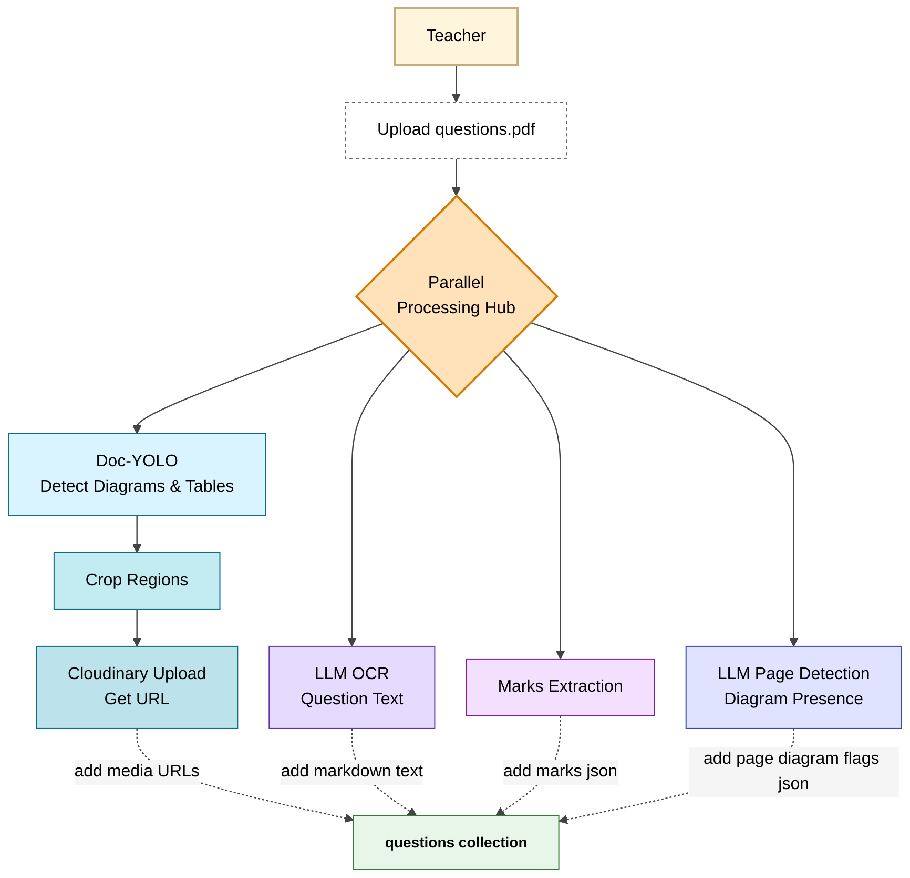

```mermaid
%%{init: {
  "theme": "base",
  "themeVariables": {
    "background": "#ffffff",
    "fontFamily": "Inter,Roboto,Helvetica,Arial,sans-serif",
    "fontSize": "16px",
    "primaryColor": "#f5f5f5",
    "primaryTextColor": "#000000",
    "primaryBorderColor": "#444444",
    "lineColor": "#444444"
  },
  "flowchart": {
    "useMaxWidth": false,
    "nodeSpacing": 30,
    "rankSpacing": 35
  }
}}%%
graph TB
    U[Teacher]:::actor --> UP[Upload questions.pdf]:::upload
    UP --> P{Parallel<br>Processing Hub}:::hub

    %% Processing branches
    P --> B1[Doc-YOLO<br>Detect Diagrams & Tables]:::detect
    B1 --> CROP[Crop Regions]:::process
    CROP --> CLOUD[Cloudinary Upload<br>Get URL]:::process2

    P --> B2[LLM OCR<br>Question Text]:::llm
    P --> B3[Marks Extraction]:::marks
    P --> B4[LLM Page Detection<br>Diagram Presence]:::llm2

    %% Single collection
    QC[questions collection]:::mongoMain

    %% Incremental enrichment (dashed with pipe labels)
    CLOUD -.->|add media URLs| QC
    B2    -.->|add markdown text| QC
    B3    -.->|add marks json| QC
    B4    -.->|add page diagram flags json| QC

    %% Classes
    classDef actor fill:#fff5dd,stroke:#c3ad7c,stroke-width:2px;
    classDef upload fill:#ffffff,stroke:#666,stroke-dasharray:3 3;
    classDef hub fill:#ffe1ba,stroke:#d27a00,stroke-width:2px;
    classDef detect fill:#d9f4ff,stroke:#0a6d8a;
    classDef process fill:#c2ecf2,stroke:#0a6d8a;
    classDef process2 fill:#bce3ec,stroke:#0a6d8a;
    classDef llm fill:#e5dbff,stroke:#5e35b1;
    classDef llm2 fill:#dfe3ff,stroke:#3949ab;
    classDef marks fill:#f3e0ff,stroke:#7b1fa2;
    classDef mongoMain fill:#e8f5e9,stroke:#2e7d32,font-size:14px,font-weight:700;

    %% Uniform link styling (then dashed edges inherit dash pattern from syntax)
    linkStyle default stroke:#444,stroke-width:1.2px;


```
