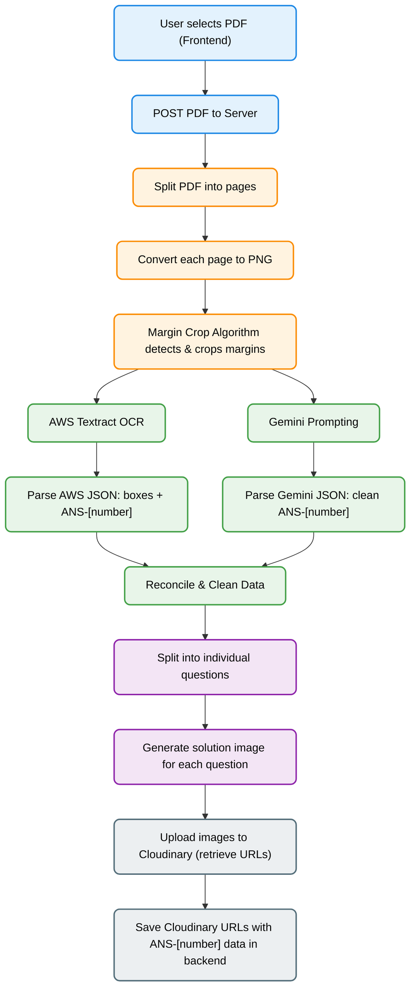

```mermaid
%%{init: {"flowchart": {"htmlLabels": false}} }%%
flowchart TD

  %% Nodes & Class Annotations
  A["User selects PDF (Frontend)"]:::upload
  B["POST PDF to Server"]:::upload

  C["Split PDF into pages"]:::preprocess
  D["Convert each page to PNG"]:::preprocess
  E["Margin Crop Algorithm detects & crops margins"]:::preprocess

  F1["AWS Textract OCR"]:::ocr
  F2["Gemini Prompting"]:::ocr
  G1["Parse AWS JSON: boxes + ANS-[number]"]:::ocr
  G2["Parse Gemini JSON: clean ANS-[number]"]:::ocr
  H["Reconcile & Clean Data"]:::ocr

  J["Split into individual questions"]:::post
  K["Generate solution image for each question"]:::post

  L["Upload images to Cloudinary (retrieve URLs)"]:::storage
  M["Save Cloudinary URLs with ANS-[number] data in backend"]:::storage


  %% Flow Arrows
  A --> B
  B --> C --> D --> E
  E --> F1 --> G1 --> H
  E --> F2 --> G2 --> H
  H --> J --> K --> L --> M

  %% Styles with black text
  classDef upload     fill:#E3F2FD,stroke:#1E88E5,stroke-width:2px,rx:8,ry:8,color:#000;
  classDef preprocess fill:#FFF3E0,stroke:#FB8C00,stroke-width:2px,rx:8,ry:8,color:#000;
  classDef ocr        fill:#E8F5E9,stroke:#43A047,stroke-width:2px,rx:8,ry:8,color:#000;
  classDef post       fill:#F3E5F5,stroke:#8E24AA,stroke-width:2px,rx:8,ry:8,color:#000;
  classDef storage    fill:#ECEFF1,stroke:#546E7A,stroke-width:2px,rx:8,ry:8,color:#000;
  classDef output     fill:#FFEBEE,stroke:#E53935,stroke-width:2px,rx:8,ry:8,color:#000;


```
